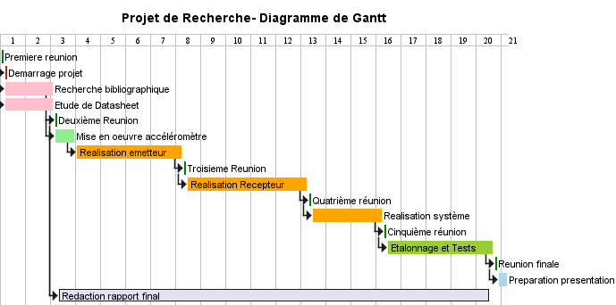
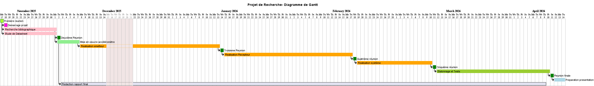
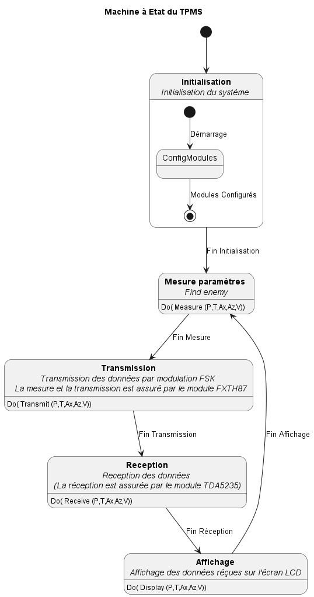

# Projet_de_Recherche_TPMS
Ce projet se concentre sur l'étude approfondie du fonctionnement,  la mise en oeuvre pratique et la calibration du TPMS constitué de de deux composants clés :  le capteur FXTH87 de NXP et le récepteur TDA5235 d'Infineon Technologies.

## Structure du Projet 

Le projet est structuré comme suite :

| Directory    | Description                                                  |
|--------------|--------------------------------------------------------------|
| docs/       | Contient la documentation du projet                    |
| docs/docs_technique/      | Contient les datasheets, et les schéma électriques            |
| docs/rapport/      | Rapport et presentation powerpoint            |
| docs/uml_files/    | Diagramme de gantt du projet, Machines à états, etc            |
| src/         | Code du système                                      |
| src/emetteur_FXTH87/     | fichiers source pour l'émetteur |
| src/recepteur_TDA5235/  | fichiers source pour le recpeteur |
| src/capteur_calibration/  | program en python pour la calibration du TPMS |
| tools/ | outils utilisés    |
| mesures/    | mésures réalisees|

### Digramme en Gantt du projet 

#### Vue sur l'année 

### Système à Réaliser 

